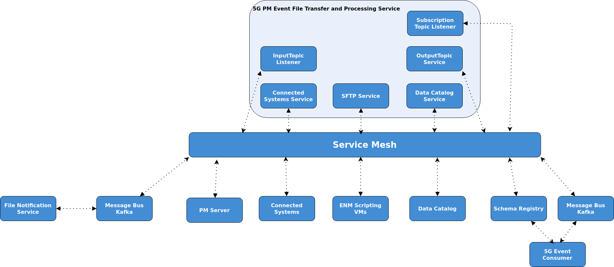

<!--Document Template information:
Prepared:Harry Foley
Approved:***
Document Name:application-developers-guide
Document Number:n/1553-APR 201 536/1
-->

[//]: # (<link href="style.css" rel="/stylesheet/user_guide_template.css"/>)

# 5G PM Event File Transfer and Processing Application Developers Guide

## Interface Description 

The 5g PM Event File Transfer and Processing Service interfaces with the following components:

* Kafka Topics
* Schema Registry
* Data Catalog
* Connected Systems
* ENM Scripting VMs
* Service Mesh

The architecture diagram below shows the relationship between the microservice and the services it interfaces with:



### DMM Kafka
Apache Kafka is part of IDUN Data Management & Movement (DMM) implemented by [Message Bus KF microservice][mbkf].
DMM Kafka holds input topics (File Notifications) and output topics.

### Data Collection Controller Topic
This topic is created by the Data Catalog and notifies services to changes in subscriptions.
Upon receiving a notification containing the service name and service instance name the microservice will fetch subscriptions from data catalog.

### Kafka Input Topic
Kafka Input topic is owned and created by the File Notification Service. It is used to alert the microservice that there are new 5G event files available.

### Kafka Output Topic
Kafka Output Topic is owned and created by the microservice and it is registered in Data Catalog. The microservice publishes the decoded events on the output topic so that they may be consumed by other microservices.

### Schema Registry
This service provides the schemas required for serialization of the decoded event files.

### Connected Systems
This service provides SFTP Credentials for the ENM Scripting VMs.

### ENM Scripting VMs
PM Event Files are transferred to the microservice from the ENM File System via an SFTP Server.

### Data Catalog
Data Catalog stores prerequisite information on the topic that the microservice is interested in. Data Catalog also provides the name of Connected Systems to the microservice.

### PM Server
Performance Management Server used for metrics, see [Performance Management Server][pms].

### Service Mesh
Optionally secure communication over mTLS HTTPS can be enabled with other
services in the mesh (enabled at global chart level).

## Configuration

The 5G PM Event File Transfer and Processing Service can be configured by providing the required formatted data to exposed parameters in the service helm chart.
The formatted data represents the content of the configuration files.
The Event Data Collector internally uses Kubernetes ConfigMaps to convert the data into configuration files.
A complete list of all configurable values is available in the User Guide, see [Configurable Values][cv].
Default values are provided for all configurable values,however they can be explicitly set at runtime using the --set argument.

## Monitoring

Metrics for the microservice are implemented using Micrometer Registry Prometheus. A Grafana dashboard is present in the project repository which can be imported into Grafana for viewing metrics. To query metrics using curl commands the service must be edited first using the command:
```
  kubectl edit service eric-oss-5gpmevt-filetx-proc
```
 Then change spec.type from "ClusterIP" to "NodePort".
A full list of metrics available can be found by running the following curl command:
```
   curl "$IP:$PORT/actuator/metrics/" | json_pp
```

For lists of standard metrics used by Java and Apache Kafka, refer to the following documentation:
* [JVM Metrics][jvmm]
* [HikariCP][hcp]
* [Message Bus KF microservice][mbkf]
* [Spring Boot Metrics][sbm]

Metrics specific to the 5g PM Event File Transfer and Processing Service are as follows:

1. Metric: eric.oss.5gpmevt.filetx.proc:num.successful.file.transfer
    * Describes the number of files successfully downloaded from the ENM Scripting VMs.
2. Metric: eric.oss.5gpmevt.filetx.proc:num.failed.file.transfer
    * Describes the number of files that failed to download from the ENM Scripting VMs. Note this number refers to the number of specific files that failed to download and not the number of times the failed file was attempted to be downloaded. 
3. Metric: eric.oss.5gpmevt.filetx.proc:transferred.file.data.volume
    * Describes the total volume of data in bytes that has been downloaded from ENM Scripting VMs.
4. Metric: eric.oss.5gpmevt.filetx.proc:event.files.processed
    * Describes the number of event files that have been successfully processed by the microservice.
5. Metric: eric.oss.5gpmevt.filetx.proc:processed.files.time.total
    * Describes the total time taken to process all files in a ROP.
6. Metric: eric.oss.5gpmevt.filetx.proc:processed.file.data.volume
    * Describes the total volume of data in bytes that the microservice has processed.
7. Metric: eric.oss.5gpmevt.filetx.proc:event.read
    * Describes the number of events that the microservice have been extracted from the event files.
8. Metric: eric.oss.5gpmevt.filetx.proc:active.subscriptions
    * Describes the number of the current active subscriptions.
9. Metric: eric.oss.5gpmevt.filetx.proc:num.files.deleted.sftp.connection.exception
    * Describes the total number of files in a batch that have been deleted when the number of event file download retries is exceeded for any file in a batch.

## References

[Service Mesh][sm]

[Message Bus KF microservice][mbkf]

[Performance Management Server][pms]  

[Configurable Values][cv]

[JVM Metrics][jvmm]

[HikariCP Metrics][hcp]

[Spring Boot Metrics][sbm]

[sm]: <https://adp.ericsson.se/marketplace/servicemesh-controller>
[mbkf]: <https://adp.ericsson.se/marketplace/message-bus-kf>
[pms]: <https://adp.ericsson.se/marketplace/pm-server>
[cv]: <https://gerrit-gamma.gic.ericsson.se/plugins/gitiles/OSS/com.ericsson.oss.adc/eric-oss-5gpmevent-filetrans-proc/+/master/doc/User_Guide/user_guide.md#Configuration-Parameters> 
[jvmm]: <https://documentation.softwareag.com/webmethods/microservices_container/msc10-7/10-7_MSC_PIE_webhelp/index.html#page/integration-server-integrated-webhelp/co-intro_new_IS_admin_6.html>
[hcp]: <https://github.com/brettwooldridge/HikariCP/blob/dev/src/main/java/com/zaxxer/hikari/metrics/micrometer/MicrometerMetricsTracker.java>
[sbm]: <https://docs.spring.io/spring-boot/docs/1.2.5.RELEASE/reference/html/production-ready-metrics.html>
