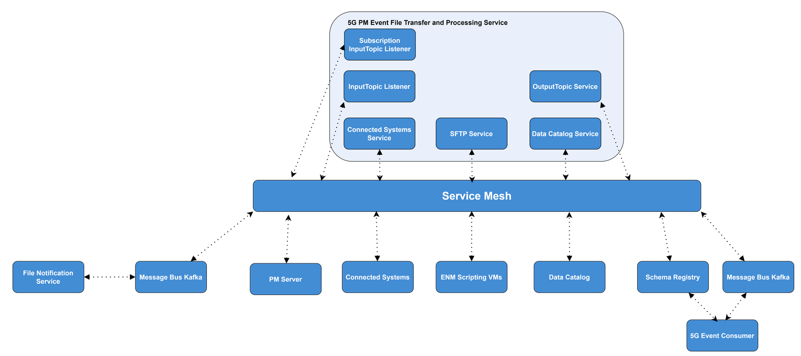

<!--Document Template information:
Prepared:Harry Foley
Approved:***
Document Name:user-guide
Document Number:n/198 17-APR 201 536/1
-->

# 5G PM Event File Transfer and Processing Service User Guide

[TOC]

## Overview

This document provides an overview of the 5G PM Event File Transfer and Processing service. It gives a brief description
of its main features and its interfaces.

The primary goal of the 5G PM Event File Transfer and Processing service is to collect 5G event files from Ericsson
Network Manager based on the subscriptions and notifications read from Message Bus KF, produced by Data Catalog and the
File Notification Service.
This service parses the 5G event files it receives and breaks up the contents of each event into protobuf serialised
records. If a record fulfil the subscription predicate requirements, the record is written onto the standardized
or ericsson Message Bus KF Output Topic, to be consumed by other services. Standard records are sent to the Standardized 
Message Bus KF Output Topic, non-standard records are sent to the Ericsson Message Bus KF Output Topic.

### Supported Use Cases

This chapter gives an overview of the supported use cases.

| Use Case ID    | Use Case Title                                                                                                                                     | Compliance      |
|----------------|----------------------------------------------------------------------------------------------------------------------------------------------------|-----------------|
| UC.ADC.PM5G.1  | Copy PM event files from Ericsson Network Manager based on notification and split the files into records, write records to a Message Bus KF topic. | Fully Supported |
| UC.ADC.PM5G.1  | Verify dependent services are up and running before starting to listen to the Message Bus KF Input Topic.                                          | Fully Supported |
| UC.ADC.PM5G.2  | Verify Necessary data is available before starting to listen to the Message Bus KF Input Topic.                                                    | Fully Supported |
| UC.ADC.PM5G.3  | Fetch data corresponding to Message Bus KF Input Topic from Data Catalog service.                                                                  | Fully Supported |
| UC.ADC.PM5G.4  | Registration of data for the 5G PM Event File Transfer and Processing service in Data Catalog.                                                     | Fully Supported |
| UC.ADC.PM5G.5  | Consumption of Message Bus KF Input Topic notification.                                                                                            | Fully Supported |
| UC.ADC.PM5G.6  | Parse Message Bus KF Input Topic notification message.                                                                                             | Fully Supported |
| UC.ADC.PM5G.7  | Fetch data from Connected Systems service.                                                                                                         | Fully Supported |
| UC.ADC.PM5G.8  | Establish SFTP connection to Ericsson Network Manager stub.                                                                                        | Fully Supported |
| UC.ADC.PM5G.9  | Download 5G event file from Ericsson Network Manager stub.                                                                                         | Fully Supported |
| UC.ADC.PM5G.10 | Decompress compressed 5G event file.                                                                                                               | Fully Supported |
| UC.ADC.PM5G.11 | Process decompressed 5G event file.                                                                                                                | Fully Supported |
| UC.ADC.PM5G.12 | Write Message to Message Bus KF Output Topic for each event in decompressed 5G event file.                                                         | Fully Supported |
| UC.ADC.PM5G.13 | Clean up performed post-processing of 5G event file.                                                                                               | Fully Supported |

### Architecture

The following picture shows the 5G PM Event File Transfer and Processing service and its architectural context.


Figure 1 Architecture view of 5G PM Event File Transfer and Processing service

#### Logical Interfaces

| Interface Logical Name | Interface Realization                | Description                                                                                                                                                                                                                                                                                                                                                                                                   | Interface Maturity |
|------------------------|--------------------------------------|---------------------------------------------------------------------------------------------------------------------------------------------------------------------------------------------------------------------------------------------------------------------------------------------------------------------------------------------------------------------------------------------------------------|--------------------|
| IF.DMM.MB.FN.TOPIC     | [Message Bus KF microservice][mbkf]  | The Message Bus KF Input topic is owned and created by the File Notification service. It is used to alert the service that there are new 5G event files available.                                                                                                                                                                                                                                            | Stable             |
| IF.DMM.MB.DC.TOPIC     | [Message Bus KF microservice][mbkf]  | The Message Bus KF Subscription Input topic is owned and created by the Data Catalog service. It is us to alert the service that there are subscriptions matching the data service name and data service instance name                                                                                                                                                                                        | Stable             | 
| IF.DMM.MB.PME.TOPIC    | [Message Bus KF microservice][mbkf]  | The Standardized and Ericsson Message Bus KF Output Topics are owned and created by the service, and they are registered in Data Catalog. The service publishes a decoded event on the Standardized or Ericsson Message Bus KF Output Topic, where standard events are sent to the Standardized Topic and non-standard events are sent to the Ericsson Topic, so that they may be consumed by other services. | Stable             |
| IF.CS.Service.REST     | [Connected Systems][cs]              | This service provides SFTP Credentials for the Ericsson Network Manager Scripting VMs.                                                                                                                                                                                                                                                                                                                        | Stable             |
| IF.ENM.SVM.SFTP        | [ENM File Notification Stub][enm]    | PM Event files are downloaded onto the service's ephemeral storage from Ericsson Network Manager's file system using it's Scripting VM interface (behaving as an SFTP server).                                                                                                                                                                                                                                | Beta               |
| IF.DMM.DC.REST         | [Data Catalog][dc]                   | Data Catalog stores prerequisite information on the topic that the service is interested in. Data Catalog also provides the name of Connected Systems to the service.                                                                                                                                                                                                                                         | Stable             |
| IF.DMM.DC.REG.REST     | [Data Catalog][dc]                   | Registers the Output Topic and Message Schema with Data Catalog.                                                                                                                                                                                                                                                                                                                                              | Stable             |
| IF.DMM.DC.SUB.REST     | [Data Catalog][dc]                   | Provides the subscriptions to the service relating to its deployed data service name and data service instance name.                                                                                                                                                                                                                                                                                          | Stable             |
| IF.DMM.SR.REST         | [Schema Registry SR][sr]             | This service stores and provides the schemas required for serialization of the decoded event files.                                                                                                                                                                                                                                                                                                           | Beta               |
| IF.PM.METRICS.PULL     | [Performance Management Server][pms] | Performance Management Server is used for metrics.                                                                                                                                                                                                                                                                                                                                                            | Beta               |

#### Application Programming Interfaces (APIs)

The 5G PM Event File Transfer and Processing service does not provide any APIs.

### Deployment View

5G PM Event File Transfer and Processing service is packaged as a Docker image. It supports deployment in
Kubernetes using Helm.

The jar of the 5G PM Event File Transfer and Processing service is stored in one container in a pod. It supports one or
more pod replicas (instances of the service). When Service Mesh is enabled, a proxy sidecar is deployed within a pod and
REST end points will use HTTPS.

Once deployed the service will query Data Catalog for the entry of the Input Topic, this provides the service with:

1. The Message Bus KF address on which the Input Topic exists (Message Bus KF is taken from the ADP Marketplace and is
   realised by Data Management and Movement. All references to Kafka refer to Message Bus KF).
2. The entry for Connected Systems which contains the credentials to login to the Ericsson Network Manager Scripting VM,
   from which the service will be SFTPing the Pm Event files from.

Once this perquisite information is retrieved, the service can then register the Output Topic entry on Data Catalog.
The **OutputTopic Service** then creates the Output Topic on Message Bus KF.
This is the same instance of Message Bus KF that the service queried for the Input Topic.
Both topics must exist on the same instance to facilitate transactions

The service listens to a Subscription Input Topic that is produced by Data Catalog.
The Subscription Input Topic is a shared topic that contains subscription notifications. The **Subscription Input Topic
Listener** receives
notification(s) about subscription(s), who's data service name and data service instance name match with the deployed
data service name and
data service instance name. The service then queries Data Catalog to get the list of applicable and active subscriptions
for the data service name
and data service instance name. The subscriptions are then stored in a Subscription Cache, which is thread safe. The
subscriptions inform the
service to only produce events which match the subscription predicates (node name(s) and or event id(s)).

The service listens to an Input Topic that is produced by the File Notification service.
The Input Topic records contain the path to the file to be retrieved from the Ericsson Network Manager Scripting VM.
The **InputTopic Listener** utilises a kafka record filter strategy on the node name predicate, to cut down on
unnecessary downloading/processing
of unwanted consumer records from the Input Topic.
The **InputTopic Listener** receives these records, parses them and initiates the downloading of PM Event files using
the **SFTP service** from the Ericsson Network Manager Scripting VM.

Each of these files will exist in ephemeral storage, decompressed if necessary, then split into individual events that
are to be sent to either the Standardized or Ericsson Output Topic if the event fulfils the subscription predicates requirements, 
as defined in the Subscription Cache. Standard events are sent to the Standardized Topic, non-standard events are sent to the 
Ericsson Topic.
The **InputTopic Listener** receives files in batches, and will frame the total Output messages in a batch as a singular
Kafka Transaction.
This is to ensure Exactly Once Semantics (EOS) for the Output Topic.
In order to guarantee Transactions/EOS, the Input and Output topics must exist on the same Kafka Brokers.



Figure 2 Deployment view of 5G PM Event File Transfer and Processing service

To deploy the service, refer to the [Deployment section](#deployment), which:

- Explains how to get started using the 5G PM Event File Transfer and Processing service in the
  supported environments.
- Specifies configuration options for starting the 5G PM Event File Transfer and Processing docker
  container.

If problems occur when using the service, refer to the [Troubleshooting section](#troubleshooting).

### Dimensioning and Characteristics

#### Dimensioning

The service provides by default resource request values and resource limit values as part of the Helm chart.
It should be noted that the number of listeners inside a pod is bound by the amount of CPU. One CPU core is required for
each listener.

To handle dimensioning configuration at deployment time,
refer to the [Deployment section](#deployment).

#### Scaling

The service supports manual scaling which can be set using the replicaCount parameter in values.yaml.

> **_Note:_** Manual scaling is a time-consuming process and should not be done frequently.

If manual scaling is performed through Helm during the middle of a ROP the Consumer will be rebalanced, work distributed
amongst new pods/listeners by partition.
Scaling performance is bound by the maximum number of SFTP connections supported by the Ericsson Network Manager
Scripting VM and how many Scripting VMs are available. The scaling performance is also dependent on the number of Input
Topic partitions set by the File Notification Service and the number of consumers on the service set
by ```spring.kafka.topics.input.concurrency``` in the values.yaml.

> Max number of Replicas pods = Input Topic partitions / consumers per pod (concurrency)

For example:
> 10 Input Topic partitions / 2 Concurrency = 5 Replica pods

| Scaling Supported (Yes/No) | Minimum number of instances | Maximum number of recommended instances |
|----------------------------|-----------------------------|-----------------------------------------|
| Yes (Manual)               | 1                           | 5                                       |

> **_Note:_** The Subscription Input Topic has hardcoded its concurrency to one. When set to one, alongside using a
> random subscription consumer group id, it is ensured that each replica in a replicaset reads from all partitions.

#### Resilience

* Transactions are used to implemented exactly-once semantics to ensure no data is duplicated if a batch of files fails
  halfway through processing files.

* 5G PM Event File Transfer and Processing Service uses Liveness and Readiness probes provided by Kubernetes.

* By default, the 5G PM Event File Transfer and Processing Service has a replica count of 1. This can be increased in
  the values.yaml or at deployment time using --set arguments to provided higher availability.

* A circuit breaker design pattern is used for providing [Resilience](#resilience) with SFTP connections and file
  downloading. The related parameters are set in the values.yaml under eventFileDownload,
  see [Configuration Parameters](#configuration-parameters) for details.

* When the 5G PM Event File Transfer and Processing Service pod is deployed when there are no external dependencies
  available the pod waits gracefully for dependent services to be ready. As dependent services become available the
  service proceeds to normal operation. The diagram below shows the flow of these external dependency checks.

  

#### Upgrade - In Service Software Upgrade

5G PM Event File Transfer and Processing service supports upgrade without loss of notifications. If a 5G PM Event File
Transfer and Processing pod is upgraded while processing Event Files the number of events outputted by the upgraded pod
is as expected from a pod in normal operation.
This is achieved through Kuberenetes' rolling update strategy, see [Kubernetes Rolling Update][kru]. Rolling updates
incrementally replace your resource's Pods with new ones, which are then scheduled on nodes with available resources.
Rolling updates are designed to update your workloads without downtime.
Retaining data with persistent volumes is not an issue for the 5G PM Event Transfer and Processing service as the
service is stateless.

> **_Note:_** If non default values have been set using the --set arguments at deployment they must be set again when
> performing an upgrade.

## Deployment

This section describes the operational procedures for how to deploy and upgrade
the 5G PM Event File Transfer and Processing service in a Kubernetes environment with Helm. It also
covers hardening guidelines to consider when deploying this service.

### Prerequisites - more to fill in

List of prerequisites for service deployment.<br/>

- A running Kubernetes environment with Helm support, some knowledge
  of the Kubernetes environment, including the networking detail, and
  access rights to deploy and manage workloads.

- Availability of the kubectl CLI tool with correct authentication
  details. Contact the Kubernetes System Admin if necessary.

- Availability of the Helm package.

- Availability of Helm charts and Docker images for the service and
  all dependent services:
    - Data Management and Movement
    - File Notification Service (Stub)
    - Connected Systems
    - Proxy Sidecar when mTLS support is required

### Custom Resource Definition (CRD) Deployment

No Custom Resource Definitions are used with the 5G PM Event File Transfer and Processing service.

### Deployment in a Kubernetes Environment Using Helm

This section describes how to deploy the service in Kubernetes using Helm and
the `kubectl` CLI client. Helm is a package manager for Kubernetes that
streamlines the installation and management of Kubernetes applications.

#### Preparation

Prepare Helm chart and Docker images. Helm chart in the following link
can be used for installation:

https://arm.seli.gic.ericsson.se/artifactory/proj-eric-oss-drop-helm/eric-oss-5gpmevt-filetx-proc/

#### Pre-Deployment Checks for 5G PM Event Transfer and Processing Service

Ensure the following:

- The <RELEASE_NAME> is not used already in the corresponding cluster.
  Use `helm list` command to list the existing deployments (and delete previous
  deployment with the corresponding <RELEASE_NAME> if needed).

- The same namespace is used for all deployments.

#### Helm Chart Installations of Dependent Services

This service requires Data Management and Movement, File Notification Service Stub and Connected Systems to be installed
on the same namespace prior to deploying the service.

- Data Management and Movement installation:

  Refer to Data Management and Movement documentation at [Data management and Movement][dmm].

  ```text
  helm install dmm https://arm.seli.gic.ericsson.se/artifactory/proj-eric-oss-drop-helm-local/eric-oss-dmm/<LATEST_RELEASE> --set global.registry.username=<USER_NAME> --set global.registry.password=<USER_PASSWORD> --set tags.data-catalog=true --set tags.schema-registry=true --set tags.data-coordinator-zk=true --set tags.message-bus-kf=true --wait --set global.pullSecret=<PULL_SECRET> --namespace <NAME_SPACE>
  ```

- File Notification Service (Stub):

  Refer to File Notification Service Stub documentation at [ENM File Notification Stub][enm].

  ```text
  helm install eric-oss-file-notification-enm-stub-release https://arm.seli.gic.ericsson.se/artifactory/proj-eric-oss-drop-helm/eric-oss-file-notification-enm-stub/<LATEST_RELEASE> --namespace <NAME_SPACE> --set global.pullSecret=<PULL_SECRET> --timeout 5m0s --wait
  ```

- Connected Systems:

  Refer to Connected Systems documentation at [Connected Systems][cs].
  ```
  helm install connected-systems https://arm.rnd.ki.sw.ericsson.se/artifactory/proj-so-gs-all-helm/eric-eo-subsystem-management/<LATEST_RELEASE> --namespace <NAME_SPACE> --set global.registry.username=<USER_NAME> --set global.registry.password=<USER_PASSWORD> --set global.pullSecret=<PULL_SECRET>
  ```

#### Helm Chart Installation of 5G PM Event File Transfer and Processing Service

> **_Note:_** Ensure all dependent services are deployed and healthy before you
> continue with this step (see previous chapter).

Helm is a tool that streamlines installing and managing Kubernetes
applications. 5G PM Event File Transfer and Processing service can be deployed on Kubernetes using
Helm Charts. Charts are packages of pre-configured Kubernetes resources.

Users can override the default values provided in the values.yaml template of
the Helm chart. The recommended parameters to override are listed in the
following section: [Configuration Parameters](#configuration-parameters).

##### Deploy the 5G PM Event File Transfer and Processing Service

Below is the generic format for the Helm installation command:

```text
helm install <RELEASE_NAME> <CHART_REFERENCE> --namespace <NAMESPACE>
```

The variables specified in the command are as follows:

- `<CHART_REFERENCE>`: A path to a packaged chart, a path to an unpacked chart
  directory or a URL.

- `<RELEASE_NAME>`: String value, a name to identify and manage your Helm chart.

- `<NAMESPACE>`: String value, a name to be used dedicated by the user for
  deploying own Helm charts.

To install the 5G PM Event File Transfer and Processing service on the Kubernetes cluster by using the
helm installation command, specifying the name of the Input Topic to subscribe to:

* Example deployment with default parameters:
  ```text
  helm install eric-oss-5gpmevt-filetx-proc https://arm.seli.gic.ericsson.se/artifactory/proj-eric-oss-drop-helm/eric-oss-5gpmevt-filetx-proc/<LATEST_RELEASE> --namespace <NAMESPACE> --set global.registry.username=<USER_NAME> --set global.registry.password=<USER_PASSWORD> --set global.pullSecret=<PULL_SECRET> -- spring.kafka.topics.input.name=<INPUT_TOPIC_NAME>
  ```

* Example deployment with optional parameters:
  ```text
  helm install eric-oss-5gpmevt-filetx-proc https://arm.seli.gic.ericsson.se/artifactory/proj-eric-oss-drop-helm/eric-oss-5gpmevt-filetx-proc/<LATEST_RELEASE> --namespace <NAMESPACE> --set global.registry.username=<USER_NAME> --set global.registry.password=<USER_PASSWORD> --set global.pullSecret=<PULL_SECRET> --set spring.kafka.topics.input.name=<INPUT_TOPIC_NAME> --set resources.eric-oss-5gpmevt-filetx-proc.limits.memory=384Mi 
  ```

##### Verify the 5G PM Event File Transfer and Processing Service Availability

To verify whether the deployment is successful, do as follows:

*1. Check if the chart is installed with the provided release name and
in related namespace by using the following command:*

```text
$helm ls <namespace>
```

*Chart status should be reported as "DEPLOYED".*

*2. Verify the status of the deployed Helm chart.*

```text
$helm status <release_name>
```

Expected output should be:

```
NAME: eric-oss-5gpmevt-filetx-proc-release
LAST DEPLOYED: Thu Mar 3 09:07:38 2022
NAMESPACE: <NAMES_SPACE>
STATUS: deployed
REVISION: 1
NOTES:
====
```

*Chart status should be reported as "DEPLOYED". All Pods status should be
reported as "Running" and number of Deployment Available should be the
same as the replica count.*

*3. Verify that the pods are running
by getting the status for your pods.*

```text
$kubectl get pods --namespace=<namespace> -L role
```

*For example:*

```text
$helm ls example
$helm status examplerelease
$kubectl get pods --namespace=example -L role
```

*All pods status should be "Running". All containers in any pod should
be reported as "Ready". There is one POD marked as the master role and
the other PODs are marked as the replica role.*>

### Configuration Parameters

#### Mandatory Configuration Parameters

The parameters in following table are mandatory to set at deployment time.
If not provided, the deployment will fail. There currently are no default values
provided for this type of parameters.

#### Optional Configuration Parameters

Following parameters are not mandatory. If not explicitly set
(using the --set argument), the default values provided in the helm chart are used.

##### Service Specific Optional Parameters

Kafka Optional Parameters, for further reading see [Kafka Configuration][kfc]:

| Variable Name                                                     | Description                                                                                                                                                                                                                                                                                                                                                                                                                                                                                                                                                                                                                                                                                                                                                                                                                                                                                                                                                                                                                                                           | Default                                                     |
|-------------------------------------------------------------------|-----------------------------------------------------------------------------------------------------------------------------------------------------------------------------------------------------------------------------------------------------------------------------------------------------------------------------------------------------------------------------------------------------------------------------------------------------------------------------------------------------------------------------------------------------------------------------------------------------------------------------------------------------------------------------------------------------------------------------------------------------------------------------------------------------------------------------------------------------------------------------------------------------------------------------------------------------------------------------------------------------------------------------------------------------------------------|-------------------------------------------------------------|
| spring.kafka.admin.retry                                          | Maximum number of reattempts for the kafka admin bean. Used to create and check the existence of topics on the Message Bus KF at deployment time.                                                                                                                                                                                                                                                                                                                                                                                                                                                                                                                                                                                                                                                                                                                                                                                                                                                                                                                     | 2147483647                                                  |
| spring.kafka.admin.retryBackOffMs                                 | The back off time between reattempts to perform operations on the kafka cluster.                                                                                                                                                                                                                                                                                                                                                                                                                                                                                                                                                                                                                                                                                                                                                                                                                                                                                                                                                                                      | 100 (ms)                                                    |
| spring.kafka.admin.reconnectBackOffMs                             | The base amount of time to wait before attempting to reconnect to a given host. This avoids repeatedly connecting to a host in a tight loop. This backoff applies to all connection attempts by the client to a broker.                                                                                                                                                                                                                                                                                                                                                                                                                                                                                                                                                                                                                                                                                                                                                                                                                                               | 50 (ms)                                                     |
| spring.kafka.admin.reconnectBackOffMaxMs                          | The maximum amount of time in milliseconds to wait when reconnecting to a broker that has repeatedly failed to connect. If provided, the backoff per host will increase exponentially for each consecutive connection failure, up to this maximum. After calculating the backoff increase, 20% random jitter is added to avoid connection storms.                                                                                                                                                                                                                                                                                                                                                                                                                                                                                                                                                                                                                                                                                                                     | 30000 (ms)                                                  |
| spring.kafka.admin.requestTimeoutMs                               | The configuration controls the maximum amount of time the client will wait for the response of a request. If the response is not received before the timeout elapses the client will resend the request if necessary or fail the request if retries are exhausted.                                                                                                                                                                                                                                                                                                                                                                                                                                                                                                                                                                                                                                                                                                                                                                                                    | 30000 (ms)                                                  |
| spring.kafka.producer.retryBackOffMs                              | The amount of time to wait before attempting to retry a failed request to a given topic partition. This avoids repeatedly sending requests in a tight loop under some failure scenarios.                                                                                                                                                                                                                                                                                                                                                                                                                                                                                                                                                                                                                                                                                                                                                                                                                                                                              | 100 (ms)                                                    |
| spring.kafka.producer.reconnectBackOffMs                          | The base amount of time to wait before attempting to reconnect to a given host. This avoids repeatedly connecting to a host in a tight loop. This backoff applies to all connection attempts by the client to a broker.                                                                                                                                                                                                                                                                                                                                                                                                                                                                                                                                                                                                                                                                                                                                                                                                                                               | 50 (ms)                                                     |
| spring.kafka.producer.reconnectBackOffMaxMs                       | The maximum amount of time in milliseconds to wait when reconnecting to a broker that has repeatedly failed to connect. If provided, the backoff per host will increase exponentially for each consecutive connection failure, up to this maximum. After calculating the backoff increase, 20% random jitter is added to avoid connection storms.                                                                                                                                                                                                                                                                                                                                                                                                                                                                                                                                                                                                                                                                                                                     | 30000 (ms)                                                  |
| spring.kafka.producer.requestTimeoutMs                            | The maximum amount of time the client will wait for the response of a request. If the response is not received before the timeout elapses the client will resend the request if necessary or fail the request if retries are exhausted.                                                                                                                                                                                                                                                                                                                                                                                                                                                                                                                                                                                                                                                                                                                                                                                                                               | 30000 (ms)                                                  |
| spring.kafka.consumer.autoOffsetReset                             | 3 possible values. Decides on whether to consume from the beginning of a topic partition or only consume new message when no initial offset is provided ("earliest" = beginning of topic, "latest" = end of topic, "none" = throw exception if no offset present for consumer group).                                                                                                                                                                                                                                                                                                                                                                                                                                                                                                                                                                                                                                                                                                                                                                                 | latest                                                      |
| spring.kafka.consumer.retryBackOffMs                              | The amount of time to wait before attempting to retry a failed request to a given topic partition. This avoids repeatedly sending requests in a tight loop under some failure scenarios.                                                                                                                                                                                                                                                                                                                                                                                                                                                                                                                                                                                                                                                                                                                                                                                                                                                                              | 100 (ms)                                                    |
| spring.kafka.consumer.reconnectBackOffMs                          | The base amount of time to wait before attempting to reconnect to a given host. This avoids repeatedly connecting to a host in a tight loop. This backoff applies to all connection attempts by the client to a broker.                                                                                                                                                                                                                                                                                                                                                                                                                                                                                                                                                                                                                                                                                                                                                                                                                                               | 50 (ms)                                                     |
| spring.kafka.consumer.reconnectBackOffMaxMs                       | The maximum amount of time in milliseconds to wait when reconnecting to a broker that has repeatedly failed to connect. If provided, the backoff per host will increase exponentially for each consecutive connection failure, up to this maximum. After calculating the backoff increase, 20% random jitter is added to avoid connection storms.                                                                                                                                                                                                                                                                                                                                                                                                                                                                                                                                                                                                                                                                                                                     | 30000 (ms)                                                  |
| spring.kafka.consumer.requestTimeoutMs                            | The configuration controls the maximum amount of time the client will wait for the response of a request. If the response is not received before the timeout elapses the client will resend the request if necessary or fail the request if retries are exhausted.                                                                                                                                                                                                                                                                                                                                                                                                                                                                                                                                                                                                                                                                                                                                                                                                    | 30000 (ms)                                                  |
| spring.kafka.subscriptionConsumer.autoOffsetReset                 | 3 possible values. Decides on whether to consume from the beginning of a topic partition or only consume new message when no initial offset is provided ("earliest" = beginning of topic, "latest" = end of topic, "none" = throw exception if no offset present for consumer group).                                                                                                                                                                                                                                                                                                                                                                                                                                                                                                                                                                                                                                                                                                                                                                                 | latest                                                      |
| spring.kafka.subscriptionConsumer.retryBackOffMs                  | The amount of time to wait before attempting to retry a failed request to a given topic partition. This avoids repeatedly sending requests in a tight loop under some failure scenarios.                                                                                                                                                                                                                                                                                                                                                                                                                                                                                                                                                                                                                                                                                                                                                                                                                                                                              | 100 (ms)                                                    |
| spring.kafka.subscriptionConsumer.reconnectBackOffMs              | The base amount of time to wait before attempting to reconnect to a given host. This avoids repeatedly connecting to a host in a tight loop. This backoff applies to all connection attempts by the client to a broker.                                                                                                                                                                                                                                                                                                                                                                                                                                                                                                                                                                                                                                                                                                                                                                                                                                               | 50 (ms)                                                     |
| spring.kafka.subscriptionConsumer.reconnectBackOffMaxMs           | The maximum amount of time in milliseconds to wait when reconnecting to a broker that has repeatedly failed to connect. If provided, the backoff per host will increase exponentially for each consecutive connection failure, up to this maximum. After calculating the backoff increase, 20% random jitter is added to avoid connection storms.                                                                                                                                                                                                                                                                                                                                                                                                                                                                                                                                                                                                                                                                                                                     | 30000 (ms)                                                  |
| spring.kafka.subscriptionConsumer.requestTimeoutMs                | The configuration controls the maximum amount of time the client will wait for the response of a request. If the response is not received before the timeout elapses the client will resend the request if necessary or fail the request if retries are exhausted.                                                                                                                                                                                                                                                                                                                                                                                                                                                                                                                                                                                                                                                                                                                                                                                                    | 30000 (ms)                                                  |
| spring.kafka.topics.input.name                                    | The name of the Input Topic, which shall be used to query Data Catalog to get the perquisite information for setting up the Output topic and listening for new file notifications.                                                                                                                                                                                                                                                                                                                                                                                                                                                                                                                                                                                                                                                                                                                                                                                                                                                                                    | file-notification-service--5g-event--enm1                   |
| spring.kafka.topics.input.prefix                                  | The prefix of the Input Topic, prepending the Ericsson Network Manager instance.                                                                                                                                                                                                                                                                                                                                                                                                                                                                                                                                                                                                                                                                                                                                                                                                                                                                                                                                                                                      | file-notification-service--5g-event--                       |
| spring.kafka.topics.input.partitionAssignmentStrategy             | A list of class names or class types, ordered by preference, of supported partition assignment strategies that the client will use to distribute partition ownership amongst consumer instances when group management is used. Guarantees an assignment that is maximally balanced while preserving as many existing partition assignments as possible with cooperative rebalancing.(Should this be configurable)                                                                                                                                                                                                                                                                                                                                                                                                                                                                                                                                                                                                                                                     | org.apache.kafka.clients.consumer.CooperativeStickyAssignor |
| spring.kafka.topics.input.sessionTimeoutMs                        | The timeout used to detect client failures when using Kafka's group management facility. The client sends periodic heartbeats to indicate its liveness to the broker. If no heartbeats are received by the broker before the expiration of this session timeout, then the broker will remove this client from the group and initiate a rebalance.                                                                                                                                                                                                                                                                                                                                                                                                                                                                                                                                                                                                                                                                                                                     | 60000 (ms)                                                  |
| spring.kafka.topics.input.concurrency                             | The number of InputTopic Listeners/Consumers. This allows for parallel consumption of input messages. This number must be equal or less than the total number of input partitions for the Input topic. This service does not define the number of Input Topic partitions. Consumers cannot read from the same partitions so specifying more consumers than input partitions is a waste of resources.                                                                                                                                                                                                                                                                                                                                                                                                                                                                                                                                                                                                                                                                  | 2                                                           |
| spring.kafka.topics.input.maxPollRecords                          | The maximum number of records that a consumer/listener will fetch at a time. This is per consumer/listener.                                                                                                                                                                                                                                                                                                                                                                                                                                                                                                                                                                                                                                                                                                                                                                                                                                                                                                                                                           | 20                                                          |
| spring.kafka.topics.input.maxPollIntervalMs                       | The maximum delay between invocations of poll() when using consumer group management. This places an upper bound on the amount of time that the consumer can be idle before fetching more records. If poll() is not called before expiration of this timeout, then the consumer is considered failed and the group will rebalance in order to reassign the partitions to another member.                                                                                                                                                                                                                                                                                                                                                                                                                                                                                                                                                                                                                                                                              | 600000                                                      |
| spring.kafka.topics.subscriptionInput.name                        | The name of the subscription Input Topic, which shall be used to query Data Catalog to get the subscriptions information.                                                                                                                                                                                                                                                                                                                                                                                                                                                                                                                                                                                                                                                                                                                                                                                                                                                                                                                                             | dcc--notification-topic                                     |
| spring.kafka.topics.subscriptionInput.partitionAssignmentStrategy | A list of class names or class types, ordered by preference, of supported partition assignment strategies that the client will use to distribute partition ownership amongst consumer instances when group management is used. Guarantees an assignment that is maximally balanced while preserving as many existing partition assignments as possible with cooperative rebalancing.(Should this be configurable)                                                                                                                                                                                                                                                                                                                                                                                                                                                                                                                                                                                                                                                     | org.apache.kafka.clients.consumer.CooperativeStickyAssignor |
| spring.kafka.topics.subscriptionInput.sessionTimeoutMs            | The timeout used to detect client failures when using Kafka's group management facility. The client sends periodic heartbeats to indicate its liveness to the broker. If no heartbeats are received by the broker before the expiration of this session timeout, then the broker will remove this client from the group and initiate a rebalance.                                                                                                                                                                                                                                                                                                                                                                                                                                                                                                                                                                                                                                                                                                                     | 30000 (ms)                                                  |
| spring.kafka.topics.subscriptionInput.maxPollIntervalMs           | The maximum delay between invocations of poll() when using consumer group management. This places an upper bound on the amount of time that the consumer can be idle before fetching more records. If poll() is not called before expiration of this timeout, then the consumer is considered failed and the group will rebalance in order to reassign the partitions to another member.                                                                                                                                                                                                                                                                                                                                                                                                                                                                                                                                                                                                                                                                              | 600000                                                      |
| spring.kafka.topics.dataJobTopic.name                             | The name of the DataJob topic that is dedicated solely to the 5G PM Event File Transfer and Processing service. New DataJobs will be sent on this topic for the service to filter events on.                                                                                                                                                                                                                                                                                                                                                                                                                                                                                                                                                                                                                                                                                                                                                                                                                                                                          | service-control--eric-oss-5gpmevent-filetrans-proc          |
| spring.kafka.topics.output.prefix                                 | The prefix of the Output Topic, prepending the Ericsson Network Manager instance.                                                                                                                                                                                                                                                                                                                                                                                                                                                                                                                                                                                                                                                                                                                                                                                                                                                                                                                                                                                     | 5g-pm-event-file-transfer-and-processing--                  |
| spring.kafka.topics.output.acks                                   | acknowledgment that the producer gets from a Kafka broker to ensure that the message has been successfully committed to that broker. The config acks is the number of acknowledgments the producer needs to receive before considering a successful commit.                                                                                                                                                                                                                                                                                                                                                                                                                                                                                                                                                                                                                                                                                                                                                                                                           | all                                                         |
| spring.kafka.topics.output.compressionType                        | The compression type for all data generated by the producer. The default is none (i.e. no compression). Valid values are none, gzip, snappy, lz4, or zstd. Compression is of full batches of data, so the efficacy of batching will also impact the compression ratio (more batching means better compression).                                                                                                                                                                                                                                                                                                                                                                                                                                                                                                                                                                                                                                                                                                                                                       | lz4                                                         |
| spring.kafka.topics.output.partitions                             | The number of partitions to be created for the Output Topic. It is important to correctly provision this on deployment of the service. A topic cannot be changed to have less partitions than its current number. Increasing the number of partitions changes how messages are mapped to each topic.                                                                                                                                                                                                                                                                                                                                                                                                                                                                                                                                                                                                                                                                                                                                                                  | 20                                                          |
| spring.kafka.topics.output.replicas                               | The number of replicas for each partition. With a replication factor of 2, each message on a partition will have 2 copies spread amongst the kafka brokers. This ensures data durability/availabilty if a broker goes down.                                                                                                                                                                                                                                                                                                                                                                                                                                                                                                                                                                                                                                                                                                                                                                                                                                           | 2                                                           |
| spring.kafka.topics.output.batchSize                              | The producer will attempt to batch records together into fewer requests whenever multiple records are being sent to the same partition. This helps performance on both the client and the server. This configuration controls the default batch size in bytes. No attempt will be made to batch records larger than this size. Requests sent to brokers will contain multiple batches, one for each partition with data available to be sent. A small batch size will make batching less common and may reduce throughput (a batch size of zero will disable batching entirely). A very large batch size may use memory a bit more wastefully as we will always allocate a buffer of the specified batch size in anticipation of additional records. Note: If linger is set to zero, this parameter is ignored and records will be sent immediately. This parameter only affects the sending of messages once linger is set to above zero. Batches will be sent in one of two ways, first the batch is full, or when the amount of time defined by linger has passed. | 500000 (500KB)                                              |
| spring.kafka.topics.output.bufferMemory                           | The total bytes of memory the producer can use to buffer records waiting to be sent to the server. If records are sent faster than they can be delivered to the server the producer will block for max.block.ms after which it will throw an exception. This setting should correspond roughly to the total memory the producer will use, but is not a hard bound since not all memory the producer uses is used for buffering. Some additional memory will be used for compression (if compression is enabled) as well as for maintaining in-flight requests. The buffer will contain multiple batches. By default its 32MB, but this should directly scale with the number of Input Topic partitions and Concurrency setting above.                                                                                                                                                                                                                                                                                                                                 | 32000000 (32MB)                                             |
| spring.kafka.topics.output.maxRequestSize                         | The maximum size of a request in bytes. This setting will limit the number of record batches the producer will send in a single request to avoid sending huge requests. This is also effectively a cap on the maximum uncompressed record batch size. Note that the server has its own cap on the record batch size (after compression if compression is enabled) which may be different from this.                                                                                                                                                                                                                                                                                                                                                                                                                                                                                                                                                                                                                                                                   | 50000000 (50MB)                                             |
| spring.kafka.topics.output.linger                                 | This introduces an artificial delay between sending messages to ensure that messages can be batched together to provide better throughput. Setting this to 0 will prevent batching from happening and may reduce throughput for the service. Increasing it will introduce higher latency but may improve batching and help with I/O constraints.                                                                                                                                                                                                                                                                                                                                                                                                                                                                                                                                                                                                                                                                                                                      | 100 (100ms)                                                 |
| spring.kafka.topics.output.retentionPeriodMS                      | Duration that the Kafka message bus will retain Output Topic messages before deletion.                                                                                                                                                                                                                                                                                                                                                                                                                                                                                                                                                                                                                                                                                                                                                                                                                                                                                                                                                                                | 7200000 (2 hours)                                           |
| spring.kafka.topics.output.retentionBytesTopic                    | The amount of storage the Kafka topics can take up on the broker before deletion, this amount is split across the number of partitions configured including replicas. E.g. 100GB / (10 partitions * 2 replication) = 5GB per partition                                                                                                                                                                                                                                                                                                                                                                                                                                                                                                                                                                                                                                                                                                                                                                                                                                | 85899345920 (80GB)                                          |

5G PM Event File Transfer and Processing service Liveness and Readiness Probes:

| Variable Name                                                          | Description                                                                                                                                                                                                                                       | Default |
|------------------------------------------------------------------------|---------------------------------------------------------------------------------------------------------------------------------------------------------------------------------------------------------------------------------------------------|---------|
| probes.eric-oss-5gpmevt-filetx-proc.livenessProbe.failureThreshold     | When a probe fails, Kubernetes will try failureThreshold times before giving up. Giving up in case of liveness probe means restarting the container. In case of readiness probe the Pod will be marked Unready. Defaults to 3. Minimum value is 1 | 5       |
| probes.eric-oss-5gpmevt-filetx-proc.livenessProbe.initialDelaySeconds  | Number of seconds after the container has started before liveness or readiness probes are initiated. Defaults to 0 seconds. Minimum value is 0.                                                                                                   | 90      |
| probes.eric-oss-5gpmevt-filetx-proc.livenessProbe.periodSeconds        | How often (in seconds) to perform the probe. Default to 10 seconds. Minimum value is 1.                                                                                                                                                           | 10      |
| probes.eric-oss-5gpmevt-filetx-proc.livenessProbe.timeoutSeconds       | Number of seconds after which the probe times out. Defaults to 1 second. Minimum value is 1.                                                                                                                                                      | 10      |
| probes.eric-oss-5gpmevt-filetx-proc.readinessProbe.failureThreshold    | When a probe fails, Kubernetes will try failureThreshold times before giving up. Giving up in case of liveness probe means restarting the container. In case of readiness probe the Pod will be marked Unready. Defaults to 3. Minimum value is 1 | 5       |
| probes.eric-oss-5gpmevt-filetx-proc.readinessProbe.initialDelaySeconds | Number of seconds after the container has started before liveness or readiness probes are initiated. Defaults to 0 seconds. Minimum value is 0.                                                                                                   | 90      |
| probes.eric-oss-5gpmevt-filetx-proc.readinessProbe.periodSeconds       | How often (in seconds) to perform the probe. Default to 10 seconds. Minimum value is 1.                                                                                                                                                           | 10      |
| probes.eric-oss-5gpmevt-filetx-proc.readinessProbe.timeoutSeconds      | Number of seconds after which the probe times out. Defaults to 1 second. Minimum value is 1.                                                                                                                                                      | 10      |

5G PM Event File Transfer and Processing service Pod Resources:

| Variable Name                                                                 | Description                                                                                                                                       | Default |
|-------------------------------------------------------------------------------|---------------------------------------------------------------------------------------------------------------------------------------------------|---------|
| resources.eric-oss.5gpmevt-filetx-proc.requests.memory                        | The amount of memory the container is guaranteed.                                                                                                 | 2Gi     |
| resources.eric-oss.5gpmevt-filetx-proc.requests.cpu                           | The amount of CPU the container is guaranteed.                                                                                                    | 1000m   |
| resources.eric-oss.5gpmevt-filetx-proc.requests.ephemeral-storage             | The amount of ephemeral storage the container is guaranteed.                                                                                      | 5G      |
| resources.eric-oss.5gpmevt-filetx-proc.limits.memory                          | The maximum amount of memory the container is allowed before it is restricted.                                                                    | 2.5Gi   |
| resources.eric-oss.5gpmevt-filetx-proc.limits.cpu                             | The maximum amount of CPU the container is allowed before it is restricted.                                                                       | 3000m   |
| resources.eric-oss.5gpmevt-filetx-proc.limits.ephemeral-storage               | The maximum amount of ephemeral storage the container is allowed before it is restricted.                                                         | 15G     |
| resources.eric-oss.5gpmevt-filetx-proc.jvm.initialMemoryAllocationPercentage  | Sets the initial amount of memory that the JVM heap can use in relation to the container memory limit.                                            | 50%     |
| resources.eric-oss.5gpmevt-filetx-proc.jvm.smallMemoryAllocationMaxPercentage | Sets the maximum amount of memory that the JVM heap can use in relation to the container memory limit (when the container memory limit < 250 MB). | 70%     |
| resources.eric-oss.5gpmevt-filetx-proc.jvm.largeMemoryAllocationMaxPercentage | Sets the maximum amount of memory that the JVM heap can use in relation to the container memory limit (when the container memory limit > 250 MB). | 50%     |

5G PM Event File Transfer and Processing service Network Policy:

| Variable Name                              | Description                                                                                                            | Default                                                                                                          |
|--------------------------------------------|------------------------------------------------------------------------------------------------------------------------|------------------------------------------------------------------------------------------------------------------|
| networkPolicy.enabled                      | Enable the use of Network Policies, depends on `global.networkPolicy.enabled` to be set to `true` too.                 | true                                                                                                             |
| networkPolicy.podSelector                  | List of labels and the associated values for ingress and egress (incoming and outgoing connections respectively) rules |                                                                                                                  |
| networkPolicy.podSelector.label            | Kubernetes label for an entity for which the rules will apply                                                          | app.kubernetes.io/name                                                                                           |
| networkPolicy.podSelector.ingress          | List of values for the associated label, ingress port and its protocol for which the ingress rule applies              |                                                                                                                  |
| networkPolicy.podSelector.ingress.value    | Value for the associated label                                                                                         | eric-pm-server                                                                                                   |
| networkPolicy.podSelector.ingress.port     | Ingress port number                                                                                                    | 33631                                                                                                            |
| networkPolicy.podSelector.ingress.protocol | Allowed protocol for the port, possible options are TCP and UDP                                                        | TCP                                                                                                              |
| networkPolicy.podSelector.egress           | List of values for the associated label for which the allow egress rule applies                                        | [eric-oss-dmm-data-message-bus-kf, eric-oss-data-catalog, eric-schema-registry-sr, eric-eo-subsystem-management] |
| networkPolicy.port.egress                  | List of allowed ports and their respective protocols for outgoing connections                                          |                                                                                                                  |
| networkPolicy.port.egress.port             | Egress port number                                                                                                     | [53, 53, 22]                                                                                                     |
| networkPolicy.port.egress.protocol         | Allowed protocol for the port, possible options are TCP and UDP                                                        | [TCP, UDP, TCP]                                                                                                  |

Miscellaneous Optional Parameters:

| Variable Name                                              | Description                                                                                                                                                                                                                                                                                                                                                 | Default                       |
|------------------------------------------------------------|-------------------------------------------------------------------------------------------------------------------------------------------------------------------------------------------------------------------------------------------------------------------------------------------------------------------------------------------------------------|-------------------------------|
| security.tls.enabled                                       | Enable or disable TLS.                                                                                                                                                                                                                                                                                                                                      | false (Currently not enabled) |
| replicaCount                                               | Number of Service pod Replicas to create.                                                                                                                                                                                                                                                                                                                   | 1                             |
| podDisruptionBudget.minAvailable                           | Minimum number/percentage of Pods that must remain available during the planned disruption. Value can be expressed as an integer or as a percentage. When specified as a percentage of the Pods, if it does not map to an exact number, Kubernetes rounds up to the nearest integer.minAvailable: 2 example value for 2 pods defined as integer.            | 40%                           |
| updateStrategy.type                                        | How to apply updates to the Services deployment to replicas.                                                                                                                                                                                                                                                                                                | RollingUpdate                 |
| updateStrategy.rollingUpdate.maxSurge                      | How many additional replicas can exist while the old replica is still available.                                                                                                                                                                                                                                                                            | 1                             |
| updateStrategy.rollingUpdate.maxUnavailable                | How many replicas can be unavailable during the update of the deployment.                                                                                                                                                                                                                                                                                   | 0                             |
| labels                                                     | Empty labels list for application deployment engineer to add more labels.                                                                                                                                                                                                                                                                                   | {}                            |
| imagePullSecrets                                           | Set the credentials to be used when pulling images from the Docker registry.                                                                                                                                                                                                                                                                                | []                            |
| nameOverride                                               | Overrides the chart name.                                                                                                                                                                                                                                                                                                                                   | ""                            |
| fullnameOverride                                           | Completely overrides the name of the deployment.                                                                                                                                                                                                                                                                                                            | ""                            |
| serviceAccount.create                                      | Specifies whether a service account should be created.                                                                                                                                                                                                                                                                                                      | true                          |
| serviceAccount.name                                        | The name of the service account to use. If not set and create is true, a name is generated using the fullname template.                                                                                                                                                                                                                                     | ""                            |
| podAnnotations                                             | Annotation to be set to pods.                                                                                                                                                                                                                                                                                                                               | {}                            | 
| podSecurityContext.supplementalGroups                      | Sets the GID value(s) for volume data that is used by the services.                                                                                                                                                                                                                                                                                         | null                          | 
| annotations                                                | Annotation to be set to deployment.                                                                                                                                                                                                                                                                                                                         | {}                            |
| service.type                                               | Specify whether node is ClusterIP or NodePort.                                                                                                                                                                                                                                                                                                              | ClusterIP                     |
| service.port                                               | The port the service is exposed on.                                                                                                                                                                                                                                                                                                                         | 33631                         |
| service.endpoints.chassisapi.tls.enforced                  | Defines whether TLS support should be enforced or HTTP support should be also allowed. Specify either "optional" to allow http also or "required" for TLS only. Only valid if global.security.tls.enabled is set to true.                                                                                                                                   | required                      |
| service.endpoints.chassisapi.tls.verifyClientCertificate   | Defines whether client certificate validation should be enforced or not. Specify either "optional" or "required". Only valid if global.security.tls.enabled is set to true.                                                                                                                                                                                 | required                      |
| ingress.enabled                                            | Enabled ingress feature of exposing REST API outside cluster.                                                                                                                                                                                                                                                                                               | false                         |
| ingress.ingressClass                                       | Ingress class name indicating which ingress controller instance is consuming the ingress resource.                                                                                                                                                                                                                                                          | OAM-IngressClass              |
| ingress.hosts.host                                         | Manages external access to the services in a cluster, typically HTTP.                                                                                                                                                                                                                                                                                       | chart-example.local           |
| ingress.hosts.paths                                        | Manages external access to the services in a cluster, typically HTTP.                                                                                                                                                                                                                                                                                       | [/]                           |
| eric-pm-server.rbac.appMonitoring.enabled                  | Enables RBAC for single Application Monitoring.                                                                                                                                                                                                                                                                                                             | true                          |
| prometheus.path                                            | Sets path to Prometheus endpoint.                                                                                                                                                                                                                                                                                                                           | /actuator/prometheus          |
| prometheus.scrape                                          | Enable or disable Prometheus, either true or false.                                                                                                                                                                                                                                                                                                         | true                          |
| terminationGracePeriodSeconds                              | Sets the amount of time a pod is given to terminate gracefully before it is terminated by force.                                                                                                                                                                                                                                                            | 30                            |
| podPriority.eric-oss-5gpmevt-filetx-proc.priorityClassName | Sets the pod's priority, e.g. high-priority.                                                                                                                                                                                                                                                                                                                | ""                            |
| autoScaling.enabled                                        | Automatically scales the number of pods based on observed CPU utilization.                                                                                                                                                                                                                                                                                  | false                         |
| autoScaling.minReplicas                                    | Minimum number of replicas to create.                                                                                                                                                                                                                                                                                                                       | 1                             |
| autoScaling.maxReplicas                                    | Maximum number of replicas to create.                                                                                                                                                                                                                                                                                                                       | 100                           |
| autoScaling.targetCPUUtilizationPercentage                 | The threshold of CPU utilization presentation. It will scale out the pod and create a new replica when the threshold is reached.                                                                                                                                                                                                                            | 80                            |
| nodeSelector                                               | Used to constrain a Pod so that it can only run on particular set of Nodes.                                                                                                                                                                                                                                                                                 | {}                            |
| topologySpreadConstraints.deployment                       | The topologySpreadConstraints specifies how to spread pods among the given topology. Valid fields are maxSkew { range=1..max }, topologyKey and whenUnsatisfiable { choice="DoNotSchedule, ScheduleAnyway" }.                                                                                                                                               | []                            |
| topologySpreadConstraints.test                             | The topologySpreadConstraints specifies how to spread pods among the given topology. Valid fields are maxSkew { range=1..max }, topologyKey and whenUnsatisfiable { choice="DoNotSchedule, ScheduleAnyway" }.                                                                                                                                               | []                            |
| tolerations.key                                            | Sets key for Kubernetes tolerations.                                                                                                                                                                                                                                                                                                                        | node.kubernetes.io/not-ready  |
| tolerations.operator                                       | Sets operator for Kubernetes tolerations.                                                                                                                                                                                                                                                                                                                   | Exists                        |
| tolerations.effect                                         | Sets effect for Kubernetes tolerations.                                                                                                                                                                                                                                                                                                                     | NoExecute                     |
| tolerations.tolerationsSeconds                             | Sets tolerations seconds for Kubernetes tolerations.                                                                                                                                                                                                                                                                                                        | 0                             |
| affinity.podAntiAffinity                                   | Pod anti-affinity guarantees the distribution of the pods across different nodes in the Kubernetes cluster. Soft anti-affinity is best-effort and might lead to the state that a node runs two replicas of the Service instead of distributing it across different nodes.                                                                                   | soft                          |
| affinity.topologyKey                                       | Pod anti-affinity topology key defines which topology domain to consider when evaluating the anti-affinity rule. Examples are the node's region, zone or hostname, among others.                                                                                                                                                                            | kubernetes.io/hostname        |
| bandwidth.maxEgressRate                                    | The rate in megabit-per-second at which traffic can leave the pod interface.                                                                                                                                                                                                                                                                                | 200M                          |
| appArmorProfile.type                                       | Configuration of AppArmor profile type. Possible values: unconfined-Indicates that there is no profile loaded. runtime/default-Applies the default profile of the container engine. localhost-Applies a specific profile loaded on the host. AppArmor support is dependent on host node capabilities, it is currently not set due to AWS not supporting it. | ""                            |
| appArmorProfile.localhostProfile                           | Refers to the AppArmor profile loaded on the node.                                                                                                                                                                                                                                                                                                          | ""                            |
| seccompProfile.type                                        | Seccomp can be used to sandbox the privileges of a process, restricting the calls it is able to make from userspace into the kernel. unconfined-Indicates that there is no profile loaded. runtime/default-Applies the default profile of the container engine. localhost-Applies a specific profile loaded on the host.                                    | RuntimeDefault                |
| seccomp.Profile.localhostProfile                           | Refers to the Seccomp profile loaded on the node.                                                                                                                                                                                                                                                                                                           | ""                            |
| httpTimeoutInSeconds                                       | HTTP Connection Timeout.                                                                                                                                                                                                                                                                                                                                    | 60                            |
| configMap.defaultMode                                      | Default permissions doe the configmap in decimal format.                                                                                                                                                                                                                                                                                                    | 493 (0755 in octal)           |
| securityPolicy.rolename                                    | Name of the associated Role or ClusterRole in the SecurityPolicy.                                                                                                                                                                                                                                                                                           | true                          |
| eventRegulation.produceNonStandard                         | Whether to produce non-standard Ericsson events (proprietary) or not. If set to true, an additional topic will be registered specifically for Ericsson non-standard events                                                                                                                                                                                  | true                          |

##### Interface Specific Optional Parameters

Data Management and Movement Optional Parameters:

| Variable Name                           | Description                                                                                                          | Default                             |
|-----------------------------------------|----------------------------------------------------------------------------------------------------------------------|-------------------------------------|
| dmm.dataCatalog.baseUrl                 | Sets base URL for Data Catalog, used to form URL for REST operations to Data Catalog.                                | http://eric-oss-data-catalog        |
| dmm.dataCatalog.basePort                | Sets base port for Data Catalog, used to form URL for REST operations to Data Catalog.                               | :9590                               |
| dmm.dataCatalog.dataServiceUri          | Sets URI used to form url for deleting data service instance entity stored on Data Catalog upon de-registration      | /catalog/v1/data-service            |
| dmm.dataCatalog.notificationTopicUri    | Sets URI used to form URL for getting notification topics from the notification topic entity stored on Data Catalog. | /catalog/v1/notification-topic/     |
| dmm.dataCatalog.dataCategory            | Sets the data category.                                                                                              | PM_EVENTS                           |
| dmm.dataCatalog.messageBusUri           | Sets URI used to form URL for getting message bus from the Messsage Bus entity stored on Data Catalog.               | /catalog/v1/message-bus             |
| dmm.dataCatalog.dataProviderTypeUri     | Sets URI used to form URL for performing DataProvidertype operations on Data Catalog.                                | /catalog/v1/data-provider-type/     |
| dmm.dataCatalog.dataSpaceUri            | Sets URI used to form URL for registering and getting DataSpace to or from Data Catalog.                             | /catalog/v1/data-space              |
| dmm.dataCatalog.dataCollectorUri        | Sets URI used to form URL for registering a DataCollector on Data Catalog.                                           | /catalog/v1/data-collector          |
| dmm.dataCatalog.messageSchemaUriV1      | Sets URI used to form URL for registering and getting message schemas (Output Topic) to and from Data Catalog.       | /catalog/v1/message-schema          |
| dmm.dataCatalog.messageSchemaUriV2      | Sets URI used to form URL for getting message schemas (Input Topic) from Data Catalog                                | /catalog/v2/message-schema          |
| dmm.dataCatalog.messageDataTopicUri     | Sets URI used to form URL for registering and getting message data topics to and from Data Catalog.                  | /catalog/v1/message-data-topic      |
| dmm.dataCatalog.messageStatusTopicUri   | Sets URI used to form URL for registering and getting message status topics to and from Data Catalog.                | /catalog/v1/message-status-topic    |
| dmm.dataCatalog.messageBusName          | Sets the name of the Message Bus to be retrieved from Data Catalog.                                                  | mb2                                 |
| dmm.dataCatalog.messageBusNamespace     | Sets the namespace where the Message Bus to be retrieved is deployed.                                                | nameSpace                           |
| dmm.dataCatalog.dataProviderType        | Sets data provider type.                                                                                             | enm                                 |
| dmm.dataCatalog.dataProviderTypeId      | Sets data provider type ID.                                                                                          | V2                                  |
| dmm.dataCatalog.dataProviderTypeVersion | Sets data provider type version.                                                                                     | v5                                  |
| dmm.dataCatalog.dataSpace               | Sets the data space.                                                                                                 | 5G                                  |
| dmm.dataCatalog.dataCollectorName       | Sets the data collector name.                                                                                        | enm1                                |
| dmm.schemaRegistry.url                  | Sets the URL for Schema Registry.                                                                                    | http://eric-schema-registry-sr:8081 |

Connected Systems Optional Parameters:

| Variable Name             | Description                              | Default                             |
|---------------------------|------------------------------------------|-------------------------------------|
| connected.systems.baseUrl | Sets the base URL for Connected Systems. | http://eric-eo-subsystem-management |
| connected.systems.port    | Sets the port for Connected Systems.     | :80                                 |
| connected.systems.uri     | Sets the URI for Connected Systems.      | subsystem-manager/v1/subsystems     |

SFTP Resilience Optional Parameters:

| Variable Name                                      | Description                                                                                                                                                                                                                  | Default |
|----------------------------------------------------|------------------------------------------------------------------------------------------------------------------------------------------------------------------------------------------------------------------------------|---------|
| eventFileDownload.numberOfSftpConnectRetries       | Max Number of times to retry reconnecting to the Ericsson Network Manager Scripting VM.                                                                                                                                      | 3       |
| eventFileDownload.numberOfEventFileDownloadRetries | Max number of times to retry downloading event file from Ericsson Network Manager Scripting VM.                                                                                                                              | 3       |
| eventFileDownload.sftpSessionTimeoutMs             | The timeout value used for socket connect operations. If connecting to the server takes longer than this value, the connection is broken. The timeout is specified in seconds and a value of zero means that it is disabled. | 15000   |
| eventFileDownload.sftpConnectBackoffMs             | The amount of time to wait between retries in connecting to the Ericsson Network Manager Scripting VM.                                                                                                                       | 1000    |

### Endpoints Exposed

The below table contains all available endpoints for the microservice.

| Endpoint                               | Description                                                                                                    | Media Type                                                                                                   |
|----------------------------------------|----------------------------------------------------------------------------------------------------------------|--------------------------------------------------------------------------------------------------------------|
| /actuator                              | Returns a list of actuator links                                                                               | application/vnd.spring-boot.actuator.v3+json, application/vnd.spring-boot.actuator.v2+json, application/json |
| /actuator/metrics                      | Returns a list of all metric names                                                                             | application/vnd.spring-boot.actuator.v3+json, application/vnd.spring-boot.actuator.v2+json, application/json |
| /actuator/metrics/{requiredMetricName} | Returns value of the metric specified eg eric.oss.5gpmevt.filetx.proc:event.files.processed                    | application/vnd.spring-boot.actuator.v3+json, application/vnd.spring-boot.actuator.v2+json, application/json |
| /actuator/health                       | Returns group options of liveness and readiness, and status of either up or down                               | application/vnd.spring-boot.actuator.v3+json, application/vnd.spring-boot.actuator.v2+json, application/json |
| /actuator/health/liveness              | Returns liveness probe status of either up or down                                                             | application/vnd.spring-boot.actuator.v3+json, application/vnd.spring-boot.actuator.v2+json, application/json |
| /actuator/health/readiness             | Returns readiness status of either up or down                                                                  | application/vnd.spring-boot.actuator.v3+json, application/vnd.spring-boot.actuator.v2+json, application/json |
| /actuator/info                         | Returns description, legal, name and version of the microservice                                               | application/vnd.spring-boot.actuator.v3+json, application/vnd.spring-boot.actuator.v2+json, application/json |
| /actuator/prometheus                   | Returns a Prometheus scrape with the appropriate format                                                        | text/plain;version=0.0.4;charset=utf-8mediaType,   application/openmetrics-text;version=1.0.0;charset=utf-8  |
| /error                                 | Returns basic error from org.springframework.boot.autoconfigure.web.servlet.error's BasicErrorController class | text/html                                                                                                    |
| /data-service-instance                 | Endpoint exposed to Helm hook job to trigger the deletion of data service instance on Data Catalog             | application/json                                                                                             |

### Service Dimensioning

The service provides by default resource request values and resource limit
values as part of the Helm chart. These values correspond to a default size for
deployment of an instance. This chapter gives guidance in how to do service
dimensioning and how to change the default values when needed.

#### Override Default Dimensioning Configuration

If other values than the default resource request and default resource limit
values are preferred, they must be overridden at deployment time.

Here is an example of the `helm install` command where resource requests and
resource limits are set:

```text
helm install eric-oss-5gpmevt-filetx-proc https://arm.seli.gic.ericsson.se/artifactory/proj-eric-oss-drop-helm/eric-oss-5gpmevt-filetx-proc/<LATEST_RELEASE> --set imageCredentials.pullSecret=armdocker --namespace test-deployment-namespace --set resources.eric-oss-5gpmevt-filetx-proc.limits.cpu=100m --set resources.eric-oss-5gpmevt-filetx-proc.limits.memory=384Mi
```

#### Use Minimum Configuration per Service Instance

This chapter specifies the minimum recommended configuration per service
instance.

| Resource Type (Kubernetes Service)               | Resource Request Memory | Resource Limit Memory | Resource Request CPU | Resource Limit CPU | Resource Request Disk | Resource Limit Disk |
|--------------------------------------------------|-------------------------|-----------------------|----------------------|--------------------|-----------------------|---------------------|
| 5G PM Event File Transfer and Processing Service | 2Gi                     | 2.5Gi                 | 1000m                | 3000m              | 5G                    | 15G                 |

To use minimum configuration, override the default values for resource requests
and resource limits in the Helm chart at deployment time.

#### Use Maximum (Default) Configuration per Service Instance

The maximum recommended configuration per instance is provided as default in the
Helm chart. Both Resource Request values and Resource Limit values are included
in the Helm charts.

### Hardening

#### Hardening during product development

* The service is built on a minimalistic container image with small footprints. Only the required libraries are
  included.
* The service utilizes a container optimized operating system (Common Base OS) and latest security patches are applied.
* The containers go through vulnerability scanning.
* The service is configured to the strict minimum of services and ports to minimize the attack surface.
* Seccomp is enabled by default with the profile "RuntimeDefault" set in values.yaml (Please
  see [Configuration Parameters](#configuration-parameters) for further details).
* The service can operate in service mesh for mTLS HTTPS support.

#### Hardening during service delivery

* Seccomp is enabled by default with the profile "RuntimeDefault" set in values.yaml (Please
  see [Configuration Parameters](#configuration-parameters) for further details). Alternative profiles may be set at
  deployment by overriding the default value by using the -- set argument.
* The service can operate in service mesh for mTLS HTTPS support.

#### Automated procedures and hardening scripts

The 5G PM Event File Transfer and Processing service does not include any automated procedures or scripts for hardening.

#### References

See the following documents for more details:

* [Hardening Guideline Instruction](https://erilink.ericsson.se/eridoc/erl/objectId/09004cff8b35654f?docno=LME-16:002235Uen&action=approved&format=msw12)
* [Hardening Guideline Template](https://erilink.ericsson.se/eridoc/erl/objectId/09004cff8b355119?docno=LME-16:002234Uen&action=approved&format=msw12)
* [Recommended Hardening Activities](https://erilink.ericsson.se/eridoc/erl/objectId/09004cffc724ed0d?docno=GFTL-21:000631Uen&action=approved&format=msw12)
* [Kubernetes Security Design Rules](https://confluence.lmera.ericsson.se/pages/viewpage.action?spaceKey=AA&title=Kubernetes+Security+Design+Rules)

### Upgrade Procedures

> **_Note:_** If any chart value is customized at upgrade time through the
> "--set" option of the "helm upgrade" command, all other previously customized
> values will be replaced with the ones included in the new version of the chart.
> To make sure that any customized values are carried forward as part of the
> upgrade, consider keeping a versioned list of such values. That list could be
> provided as input to the upgrade command in order to be able to use the "--set"
> option without side effects.

* Ensure that `spring.kafka.topics.input.name` is set correctly to the current Input Topic name.
* Ensure that `spring.kafka.topics.output.partitions` (the number of Output Topic partitions) is kept the same as the
  previous installation.
* Ensure that `spring.kafka.topics.input.concurrency` (the number of Input Topic consumers) is kept at the number as the
  previous installation.

> **_Note:_** If the user wishes to change the naming convention for the Input Topic name they must also change the
> value of `spring.kafka.topics.input.prefix` to align with the new convention.

## Security Guidelines

### Operative Tasks

This service does not include any
operative tasks.

#### External Ports

None

#### Internal Ports

| Service or Interface name             | Protocol | IP Address Type | Port    | Transport Protocol | IP Version |
|---------------------------------------|----------|-----------------|---------|--------------------|------------|
| Liveness/Readiness                    | HTTP     | OAM IP          | 33631   | TCP                | IPv4       |
| Metrics                               | HTTP     | OAM IP          | 33631   | TCP                | IPv4       |
| Schema Registry                       | HTTP     | OAM IP          | 8081    | TCP                | IPv4       |
| Message Bus KF                        | Binary   | OAM IP          | 9092    | TCP                | IPv4       |
| Data Catalog                          | HTTP     | OAM IP          | 9590    | TCP                | IPv4       |
| Connected Systems                     | HTTP     | OAM IP          | Runtime | TCP                | IPv4       |
| Ericsson Network Manager Scripting VM | SFTP     | OAM IP          | Runtime | TCP                | IPv4       |

### Certificates

No certificates are currently used.

### Security Events That Can Be Logged

No security events logged by the service.

## Privacy User Guidelines

The service processes personal data contained in PM Events and has a Privacy Technical Index (PTI) ==225. There is a
plan to remove personal data from PM Events, bringing the PTI score to 0 at a later date.

## Operation and Maintenance

### Performance Management

#### Default Metrics

Following table lists the description for all default metrics.

| Metrics Name                                                             | Description                                                                                                                                                                                                                                                        | Type    | Status |
|--------------------------------------------------------------------------|--------------------------------------------------------------------------------------------------------------------------------------------------------------------------------------------------------------------------------------------------------------------|---------|--------|
| eric.oss.5gpmevt.filetx.proc:num.successful.file.transfer                | Describes the number of files successfully downloaded from the Ericsson Network Manager Scripting VMs.                                                                                                                                                             | Counter | Stable |
| eric.oss.5gpmevt.filetx.proc:num.failed.file.transfer                    | Describes the number of files that failed to download from the Ericsson Network Manager Scripting VMs. Note this number refers to the number of specific files that failed to download and not the number of times the failed file was attempted to be downloaded. | Counter | Stable |
| eric.oss.5gpmevt.filetx.proc:transferred.file.data.volume                | Describes the total volume of data in bytes that has been downloaded from Ericsson Network Manager Scripting VMs.                                                                                                                                                  | Counter | Stable |
| eric.oss.5gpmevt.filetx.proc:event.files.processed                       | Describes the number of event files that have been successfully processed by the service.                                                                                                                                                                          | Counter | Stable |
| eric.oss.5gpmevt.filetx.proc:event.read                                  | Describes the number of events that have been extracted from the event files.                                                                                                                                                                                      | Counter | Stable |
| eric.oss.5gpmevt.filetx.proc:active.subscriptions                        | Describes the number of the current active subscriptions.                                                                                                                                                                                                          | Gauge   | Stable |
| eric.oss.5gpmevt.filetx.proc:active.data.jobs                            | Describes the number of current active DataJobs.                                                                                                                                                                                                                   | Gauge   | Stable |
| eric.oss.5gpmevt.filetx.proc:processed.files.time.total                  | Describes the total time taken to process all files in a ROP.                                                                                                                                                                                                      | Timer   | Stable |
| eric.oss.5gpmevt.filetx.proc:processed.file.data.volume                  | Describes the total volume of data in bytes that the service has processed.                                                                                                                                                                                        | Counter | Stable |
| eric.oss.5gpmevt.filetx.proc:num.files.deleted.sftp.connection.exception | Describes the total number of files in a batch that have been deleted when the number of event file download retries is exceeded for any file in a batch.                                                                                                          | Counter | Stable |

### Backup and Restore

The service does not support any kind of backup and restore operation. This is due to the service being stateless and
therefore, has not state to restore.

### Scaling

The service supports manual scaling which can be set using the `replicaCount` parameter in values.yaml.
Scaling performance is bound by the maximum number of SFTP connections supported by the Ericsson Network Manager
Scripting VM and how many Scripting VMs are available. The scaling performance is also dependent on the number of Input
Topic partitions set by the File Notification Stub and the number of consumers on the service set
by `spring.kafka.topics.input.concurrency `in the values.yaml

> Max number of Replicas pods = Input Topic partitions / consumers per pod (concurrency)

For example:
> 10 Input Topic partitions / 2 Concurrency = 5 Replica pods

## Deserializing PmEvents

The 5G PM Event File Transfer and Processing service produces 5G PM events in protobuf format.  
The latest schemas required to decode the events are provided on the service's marketplace documentation page under  
Ericsson ProtoBufs Schema and Standardized ProtoBufs Schema.  
Please follow the below instructions for how to use these schemas.

### Retrieving schemas

Navigate to the service's marketplace documentation page [here][5GMarket].  
The schema artifacts are provided as zipped archives under "Additional Documents".  
Two artifacts are available, "Standardized ProtoBufs Schema" and "Ericsson ProtoBufs Schema".

Standardized is a subset of the Ericsson schemas, containing only the schema definitions for standardized PM events.  
The Ericsson artifact contains the definitions of both Standard and Ericsson events so only this is required
to read every type of event.

### Compiling the proto schemas

#### Using protoc

The protoc executable can be used to compile the protobuf schemas into your language specific representations of PM
events.  
Full guidance for specific supported languages is available from the [Protobuf documentation][proto-docs].

Unzip the versioned schema artifact and run the following command, making sure to provide the full path to each
directory

```bash
protoc --proto_path=$HOME/5G_PM_EVENT_ERICSSON_<version>/ \
 --java_out=$HOME/5G_PM_EVENT_ERICSSON_<version>/ \
  $HOME/5G_PM_EVENT_ERICSSON_<version>/pm_event/*.proto
```

#### Using Maven Protoc jar plugin for maven java projects

The generated classes can be compiled as part of your project build by using
the [protoc-jar-maven-plugin][protoc-plugin].

Unzip the versioned schema artifact and add the inner **pm_event** folder to your projects resource folder

As an example the plugin can be configured as below, producing the compiled classes to your target directory

```xml

<plugin>
    <groupId>com.github.os72</groupId>
    <artifactId>protoc-jar-maven-plugin</artifactId>
    <version>${version.protoc-version}</version>
    <executions>
        <execution>
            <phase>generate-sources</phase>
            <goals>
                <goal>run</goal>
            </goals>
            <configuration>
                <inputDirectories>
                    <inputDirectory>${project.basedir}/src/main/resources/</inputDirectory>
                </inputDirectories>
                <includeDirectories>
                    <includeDirectory>${project.basedir}/src/main/resources/</includeDirectory>
                </includeDirectories>
                <outputTargets>
                    <outputTarget>
                        <type>java</type>
                        <addSources>main</addSources>
                        <outputDirectory>${project.basedir}/target/generated-sources/pm_event/</outputDirectory>
                    </outputTarget>
                </outputTargets>
            </configuration>
        </execution>
    </executions>
</plugin>
```

The PM event classes can then be compiled by running:

```bash
mvn clean generate-sources
```

### Consuming from and deserializing the Kafka topic

For a Spring Kafka microservice, to deserialize the 5G PM Event topic, configure your Kafka Consumer as below to  
use a Schema Registry client, a Kafka protobuf deserializer and a specific protobuf value type of
PmEventOuterClass.PmEvent class.

```java

@Bean
public ConsumerFactory<String, PmEventOuterClass.PmEvent> pmEventConsumerFactory() {
    Map<String, Object> config = new HashMap<>(7);
    config.put(ConsumerConfig.BOOTSTRAP_SERVERS_CONFIG, kafkaConfig.getBootstrapAddress());
    config.put(AbstractKafkaSchemaSerDeConfig.SCHEMA_REGISTRY_URL_CONFIG, kafkaConfig.getSchemaRegistryUrl());
    config.put(ConsumerConfig.KEY_DESERIALIZER_CLASS_CONFIG, StringDeserializer.class);
    config.put(ConsumerConfig.VALUE_DESERIALIZER_CLASS_CONFIG, KafkaProtobufDeserializer.class);
    config.put(KafkaProtobufDeserializerConfig.SPECIFIC_PROTOBUF_VALUE_TYPE, PmEventOuterClass.PmEvent.class);
    config.put(ConsumerConfig.ISOLATION_LEVEL_CONFIG, "read_committed");
    config.put(ConsumerConfig.AUTO_OFFSET_RESET_CONFIG, "earliest");

    DefaultKafkaConsumerFactory<String, PmEventOuterClass.PmEvent> factory = new DefaultKafkaConsumerFactory<>(config);
    factory.addListener(new MicrometerConsumerListener<>(meterRegistry));

    return factory;
}
```

This will allow you to deserialize the Kafka messages to PmEventOuterClass from bytes as the Kafka Listener consumes
them.  
Also note the "read_committed" configuration for the consumer. This will prevent messages from an aborted transaction  
from being read by the consumer.

### Decoding the inner Events

#### Function Level PM Event Group Parser Cache

The PM Event Group Parser Cache is required to identify the Function Level PM Event. <br>
The Function Level PM Event contains a parser which is used to decode the Inner PM Event. <br>

A sample Java PM Event Group parser implementation is outlined below:

```java
import com.ericsson.pm_event.CuCpFunctionPmEventOuterClass.CuCpFunctionPmEvent;
import com.ericsson.pm_event.CuUpFunctionPmEventOuterClass.CuUpFunctionPmEvent;
import com.ericsson.pm_event.DuFunctionPmEventOuterClass.DuFunctionPmEvent;
import com.ericsson.pm_event.PmEventOuterClass.PmEventMessageGroup;
import com.google.protobuf.Message;
import com.google.protobuf.Parser;

import java.util.EnumMap;

public class PmEventGroupParserCache {

    private final EnumMap<PmEventMessageGroup, Parser<? extends Message>> pmEventsGroupMap;

    public PmEventGroupParserCache() {
        pmEventsGroupMap = new EnumMap<>(PmEventMessageGroup.class);
        pmEventsGroupMap.put(PmEventMessageGroup.PM_EVENT_MESSAGE_GROUP_CUCP, CuCpFunctionPmEvent.parser());
        pmEventsGroupMap.put(PmEventMessageGroup.PM_EVENT_MESSAGE_GROUP_CUUP, CuUpFunctionPmEvent.parser());
        pmEventsGroupMap.put(PmEventMessageGroup.PM_EVENT_MESSAGE_GROUP_DU, DuFunctionPmEvent.parser());
    }

    public Parser<Message> getParserForPmEventGroup(final PmEventMessageGroup pmEventMessageGroup) {
        return (Parser<Message>) pmEventsGroupMap.get(pmEventMessageGroup);
    }
}
```

#### Deserialize Function Level PM Event and Inner PM Event

First, identify the Function Level PM Event group and its Function Level PM Event Group Parser. <br>
Next, using the Function Level Event group parser and Outer PM Event payload field, decode the Function Level PM
Event. <br>
Then, search the Function Level PM Event for the field descriptor matching the Event ID from the Outer PM Event. <br>
Finally, decode the Inner PM Event using the field descriptor from the Function Level PM Event.

A sample Java Inner PM Event deserializer implementation is outlined below:

```java
import com.ericsson.de.decoder.PmEventGroupParserCache;
import com.ericsson.pm_event.PmEventOuterClass;
import com.google.protobuf.Descriptors;
import com.google.protobuf.InvalidProtocolBufferException;
import com.google.protobuf.Message;
import com.google.protobuf.Parser;

public class PmEventProcessorService {

    PmEventGroupParserCache pmEventGroupParserCache = new PmEventGroupParserCache();

    void decodeOuterPmEvent(PmEventOuterClass.PmEvent outerPmEvent) throws InvalidProtocolBufferException {

        //Identify the Network Function group the event belongs to, DU, CUCP or CUUP
        PmEventOuterClass.PmEventMessageGroup eventMessageGroup = outerPmEvent.getGroup();

        Parser<?> functionLevelParser = pmEventGroupParserCache.getParserForPmEventGroup(eventMessageGroup);

        Message functionLevelPmEventMessage = (Message) functionLevelParser.parseFrom(outerPmEvent.getPayload());

        int eventID = (int) outerPmEvent.getEventId();

        // Search for the particular Function Level PM Event field descriptor using the Event ID
        Descriptors.FieldDescriptor eventFieldDescriptor = functionLevelPmEventMessage.getDescriptorForType()
                .findFieldByNumber(eventID);

        Message innerPmEvent = (Message) functionLevelPmEventMessage.getField(eventFieldDescriptor);
    }
}
```

## Troubleshooting

This section describes the troubleshooting functions and procedures for
the 5G PM Event File Transfer and Processing service. It provides the
following information:

- Common configuration issues

- Simple verification and possible recovery.

- The required information when reporting a bug or writing a support case,
  including all files and system logs that are needed.

- How to retrieve the above information from the system.

### Prerequisites

- `kubectl` CLI tool properly configured

### Installation

If Installation fails, refer [Recovery Procedure](#recovery-procedure) to recover
and [Data Collection](#data-collection) to collect logs.

### Deletion of Release

If Installation fails, refer [Recovery Procedure](#recovery-procedure) to recover
and [Data Collection](#data-collection) to collect logs.

To delete the release the service can be uninstalled by helm uninstall command:

```
  helm uninstall <RELEASE_NAME> --namespace <NAMESPACE>
```

### Health Checks

Deployment or upgrade failures with CrashLoopBackOff status:

The 5G PM Event File Transfer and Processing service has a health check that validates some service configuration
parameters. This health check uses the Kubernetes Readiness and Liveness probe. If the parameters are considered
invalid, the health check will fail. This will prevent the Diagnostic Data Collector from successfully starting, and the
pod will be in status CrashLoopBackOff.

To check if the pod is in status CrashLoopBackOff you can give the following command:

```
$ kubectl get pod --namespace=<pod's namespace>
NAME                                                   READY     STATUS             RESTARTS  AGE
eric-oss-5gpmevt-filetx-proc-6978479468-hjg2k          0/1       CrashLoopBackOff   1         14s
```

### No Active Subscription

If there are no active subscriptions then messages will not be produced, even if the rest of the service is configured
correctly.

The following message will be in the logs if there is no active subscriptions found:

```
The call to the subscriptions end point returned an empty array and Subscription cache has been reconstituted with an empty list
```

Once you've confirmed there are no active subscriptions, see [Data Catalog][dc] documentation on how to add a
subscription.

### Enable Debug Logging

Debug logging is enabled for the 5G PM Event File Transfer and Processing service.

Change the runtime log configuration of the pod by changing the eric-oss-5gpmevt-filetx-proc-log-control-configmap '
severity' field to read 'DEBUG' within logcontrol.json. Default value is 'INFO'.
Edit the eric-oss-5gpmevt-filetx-proc-log-control-configmap with the following command:

```
kubectl edit configmap eric-oss-5gpmevt-filetx-proc-log-control-configmap --namespace=<SERVICE_NAMESPACE>
 ```

### Log Categories

The 5G PM Event Transfer and Processing service does not use any log categories.

### Data Collection

- The logs are collected from each pod using the command:

```text
kubectl exec <pod name> --namespace=<pod's namespace> > <log file name>.txt
```

- The detailed information about the pod is collected using the command:

```text
kubectl describe pod <pod name> --namespace=<pod's namespace>
kubectl exec <pod-name> --namespace=<pod's namespace> env
```

### Bug Reporting and Additional Support

Issues can be handled in different ways, as listed below:

- For questions, support or hot requesting, see
  Additional Support.

- For reporting of faults, see [Bug Reporting](#bug-reporting).

#### Additional Support

If there are 5G PM Event File Transfer and Processing service support issues, use the [JIRA][jira].

#### Bug Reporting

If there is a suspected fault, report a bug. The bug report must
contain specific 5G PM Event File Transfer and Processing service information and all
applicable troubleshooting information highlighted in the
[Troubleshooting](#troubleshooting), and [Data Collection](#data-collection).

Indicate if the suspected fault can be resolved by restarting the pod, see [Restarting the Pod](#restarting-the-pod).

*When reporting a bug for the 5G PM Event File Transfer and Processing service, specify
the following in the JIRA issue:*

[JIRA][jira]

- *Issue type: Bug*
- *Component: 5G PM Event File Transfer and Processing*
- *Reported from: the level at which the issue was originally detected
  (ADP Program, Application, Customer, etc.)*
- *Application: identity of the application where the issue was observed
  (if applicable)*
- *Business Impact: the business impact caused by the issue for the affected
  users*>

### Recovery Procedure

This section describes how to recover the service in case of malfunction.

The 5G PM Event File Transfer and Processing service is stateless and does not require any recovery procedure.
The 5G PM Event File Transfer and Processing service Kubernetes pod can be restarted if users need to resolve the
problem. To restart a pod, see [Restarting the Pod](#restarting-the-pod).

#### Restarting the Pod

If a pod of the 5G PM Event File Transfer and Processing service is in abnormal status, users can restart the pod to
resolve the relevant problems.

```bash
kubectl delete pod <podname>
```

#### Data Recovery

Data recovery is not possible with the 5G PM Event File Transfer and Processing service as it is stateless.

### Known Issues

The 5G PM Event File Transfer and Processing service does not contain any known issues to date.

## References

[Service Mesh][sm]

[Message Bus KF microservice][mbkf]

[Performance Management Server][pms]

[Data Catalog][dc]

[Connected Systems][cs]

[Schema Registry SR][sr]

[ENM File Notification Stub][enm]

[Kubernetes Rolling Update][kru]

[Data management and Movement][dmm]

[Kafka Configuration][kfc]

[JIRA][jira]

[5G Marketplace documentation][5GMarket]

[Protoc-jar-maven-plugin][protoc-plugin]

[Protobuf documentation][proto-docs]

[sm]: <https://adp.ericsson.se/marketplace/servicemesh-controller>

[jira]: https://eteamproject.internal.ericsson.com/projects/GSSUPP

[mbkf]: <https://adp.ericsson.se/marketplace/message-bus-kf>

[pms]: <https://adp.ericsson.se/marketplace/pm-server>

[dc]: <https://adp.ericsson.se/marketplace/data-catalog>

[cs]: <https://adp.ericsson.se/marketplace/connected-systems>

[sr]: <https://adp.ericsson.se/marketplace/schema-registry-sr>

[enm]: <https://gerrit-gamma.gic.ericsson.se/#/admin/projects/OSS/com.ericsson.oss.adc/eric-oss-file-notification-enm-stub>

[kru]: <https://kubernetes.io/docs/tutorials/kubernetes-basics/update/update-intro/>

[dmm]: <https://confluence-oss.seli.wh.rnd.internal.ericsson.com/pages/viewpage.action?spaceKey=IDUN&title=DMM+Installation+Instructions>

[kfc]: <https://kafka.apache.org/documentation/#configuration>

[jira]: <https://jira-oss.seli.wh.rnd.internal.ericsson.com/secure/RapidBoard.jspa?rapidView=7820&projectKey=IDUN&view=planning&selectedIssue=IDUN-5166&issueLimit=100>

[5GMarket]: <https://adp.ericsson.se/marketplace/5g-pm-event-file-transfer-and-processing/documentation/development/dpi/>

[protoc-plugin]: <https://github.com/os72/protoc-jar-maven-plugin>

[proto-docs]: <https://protobuf.dev/>
